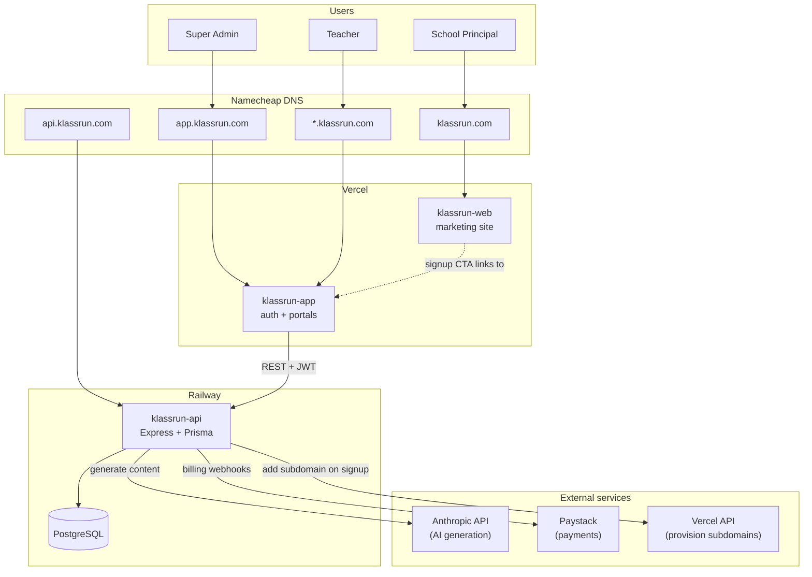
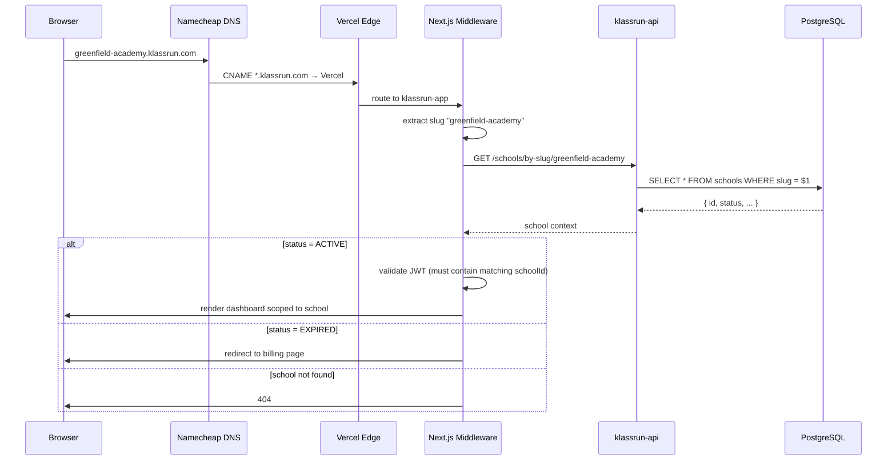
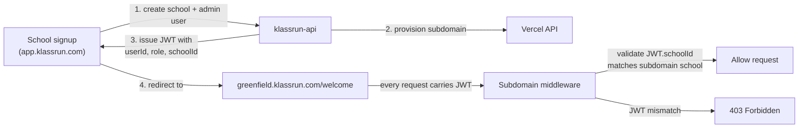

# Klassrun System Architecture

This document describes how Klassrun's three repositories fit together,
how requests flow through the system, and where every piece is deployed.

When the architecture changes, **update this file in the same PR**.

---

## High-level system

---

## Repository layout

| Repo | Domain(s) | Purpose | Stack |
|---|---|---|---|
| **klassrun-web** | `klassrun.com` | Marketing site, SEO, lead capture | Next.js, shadcn/ui, Tailwind v4 |
| **klassrun-app** | `app.klassrun.com`, `*.klassrun.com` | Auth, super admin, school portals | Next.js |
| **klassrun-api** | `api.klassrun.com` | Backend, AI, billing, all data | Node.js, Express, PostgreSQL, Prisma |

The three repos are intentionally **separate** for independent deploys and
clean boundaries. They communicate over HTTPS REST with JWT bearer tokens.

---

## Multi-tenant request flow

This is what happens when a teacher visits `greenfield-academy.klassrun.com/dashboard`:

### The critical isolation principle

**Tenant isolation is enforced at the data layer, not the UI layer.**

Every query through Prisma must include `schoolId` in the `where` clause.
The scoped Prisma client (`src/lib/db.js`) auto-injects this from the
authenticated request context. If a developer ever forgets to scope a query,
the scoped client throws an error rather than returning unscoped data.

A leaked query is a security incident. An error is a development bug.
We choose bugs.

---

## Authentication

**JWT contents:**

| Claim | Value | Used for |
|---|---|---|
| `userId` | UUID of the authenticated user | Identifying who is making the request |
| `role` | `SUPER_ADMIN`, `SCHOOL_ADMIN`, or `TEACHER` | Authorization checks |
| `schoolId` | UUID of the user's school (null for SUPER_ADMIN) | Tenant isolation |

A teacher's JWT for Greenfield cannot be reused on Sunrise's subdomain — the
middleware refuses it.

---

## External integrations

### Anthropic API (AI generation)

- Used by: `klassrun-api` only
- Authenticated via: API key in environment variable `ANTHROPIC_API_KEY`
- All requests go through `src/ai/` modules with education-only system prompts
- Rate limiting and cost tracking handled at the `klassrun-api` layer

### Paystack (payments)

- Used by: `klassrun-api` only
- Webhook endpoint: `api.klassrun.com/webhooks/paystack`
- Handles trial conversion, renewal, payment failures, cancellations

### Vercel API (subdomain provisioning)

- Used by: `klassrun-api` during school signup
- Calls `POST https://api.vercel.com/v10/projects/{projectId}/domains` to add
  `{slug}.klassrun.com` after a school signs up
- Required while we're on Vercel free tier (50-domain ceiling)
- Will be replaced by wildcard SSL when we upgrade to Pro

---

## Deployment topology

| Component | Hosted on | Free tier OK? | Notes |
|---|---|---|---|
| klassrun-web | Vercel | Yes | Static + SSR, low traffic |
| klassrun-app | Vercel | Yes (up to 50 schools) | Wildcard subdomains; needs Pro after 50 |
| klassrun-api | Railway | Yes (early) | Express + Prisma; scales with traffic |
| PostgreSQL | Railway | Yes (early) | Will need upgrades around 100+ schools |
| DNS | Namecheap | Yes | Wildcard CNAME `*` → `cname.vercel-dns.com` |

---

## Updating this document

When you change architecture:

1. Update the relevant Mermaid block above
2. Add new external services to the "External integrations" section
3. Update the "Deployment topology" table if hosting changes
4. Commit alongside the code change in the same PR

The diagrams here render natively on GitHub. View them by clicking the file
in the repo browser, or in any Markdown viewer that supports Mermaid (Notion,
Obsidian, VS Code with the Markdown Preview extension).
